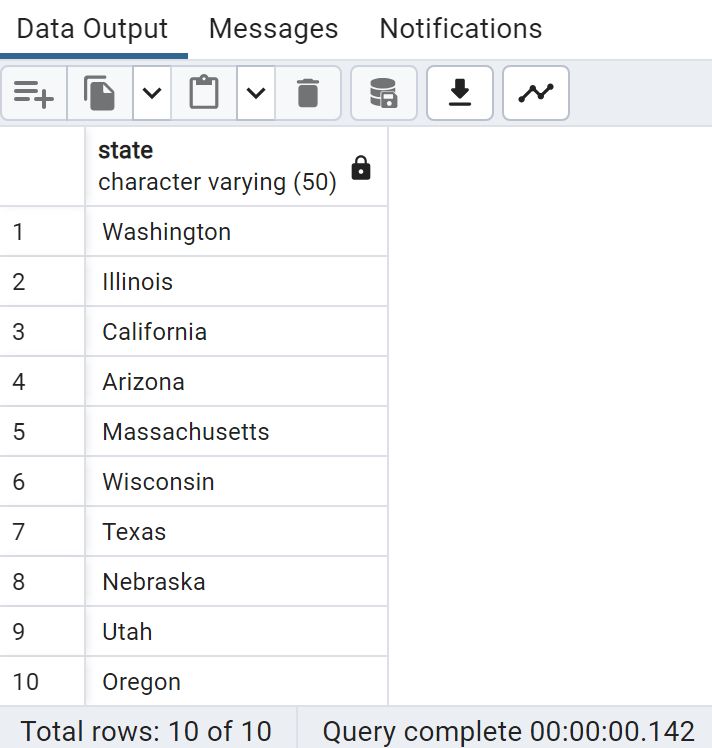
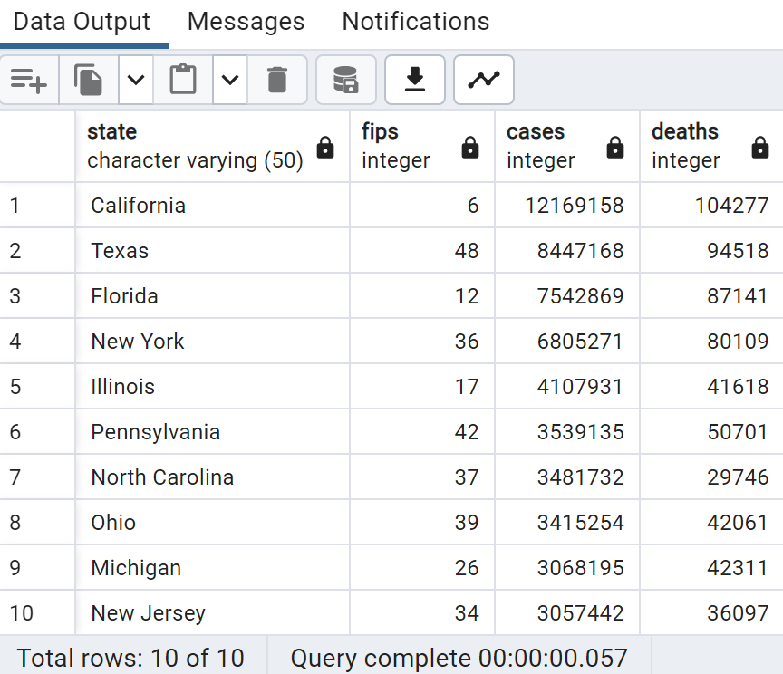

# Query Summary
Below is a description of created queries and their results.

## [first10_cases.sql](https://github.com/jhays012/Data_Projects/blob/main/SQL/Covid-19/Queries/first10_cases.sql)
### Description
This query returns the first ten states with reported cases of Covid-19. Because states in the New York Times Covid-19 data are only listed if they have had reported cases, the states that appear most often in the dataset are those that developed cases earliest and are therefore present for more days in the data. My query uses GROUP BY to group the states, ORDER BY to sort by highest state counts, and LIMIT to return the first ten results.

### Result
Washington was the first state to have reported cases of Covid-19, followed by Illinois, California, Arizona, Massachusetts, Wisconsin, Texas, Nebraska, Utah, and Oregon.

## [top10_cases.sql](https://github.com/jhays012/Data_Projects/blob/main/SQL/Covid-19/Queries/top10_cases.sql)
### Description
This query returns the ten states with the highest total number of reported cases of Covid-19. Because the New York Times Covid-19 data used is cumulative, the dates for each state contain the total reported cases up to that day. My query includes a nested query to obtain the most recent date in the data, which is associated with the maximum id value since dates are in ascending order in the dataset. My query then uses ORDER BY to sort by highest number of cases and LIMIT to return the first ten results.

### Result
As of the most recent date in the New York Times dataset (2023-03-23), California has the highest total number of reported cases of Covid-19, with 12,169,158 total cases and 104,277 total deaths. This is followed by Texas, Florida, New York, Illinois, Pennsylvania, North Carolina, Ohio, Michigan, and New Jersey. Although North Carolina has the 7th most reported cases of the ten states, it has the fewest total deaths.

